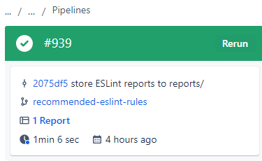
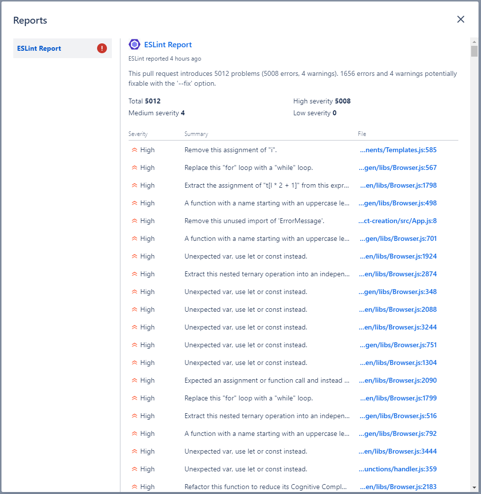

# Bitbucket Pipelines Pipe: ESLint Reporting

This pipe publishes ESLint findings as Code Insights for Bitbucket Pipelines


## YAML Definition

Add the following snippet to the script section of your `bitbucket-pipelines.yml` file:

```yaml
- pipe: docker://astraube/eslint-report-pipe:latest
  variables:
    ESLINT_TEST_JSON_INPUT: "<string>" # Required. The filename or path of a JSON file containg the output from running ESLint (with json output option).
```

## Variables

| Variable                     | Usage                                     |
| --------------               | ----------------------------------------- |
| ESLINT_TEST_JSON_INPUTN (\*) | The filename or path of a JSON file containg the output from running ESLint (with json output option). Allows globbing (e.g. `**/eslint-report.json`) |

_(\*) = required variable._

## Examples

### Basic example

```yaml
pipelines:
  default:
    - step:
        name: Run NPM
        script:
          - npm install
          - npm run build
          - npm run -- lint -f json -o reports/eslint-report.json || true
        artifacts:
          - build/**
          - reports/**
        caches:
          - node
    - step:
        name: ESLint Reporting
        script:
          - pipe: docker://astraube/eslint-report-pipe:latest
            variables:
              ESLINT_TEST_JSON_INPUT: '**/eslint-report.json'
```

## Screenshots





## References
* https://bitbucket.org/snyk/snyk-scan
* https://dev.to/julian_c/eslint-code-insights-from-bitbucket-pipelines-5dgo